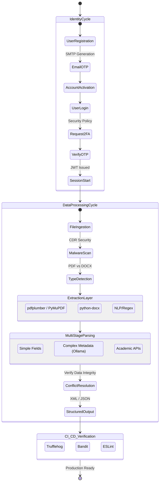
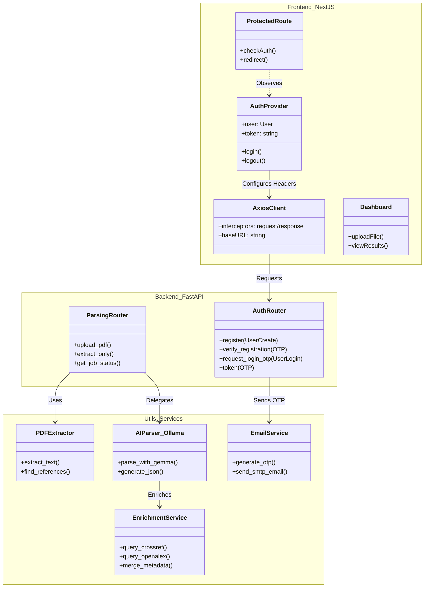
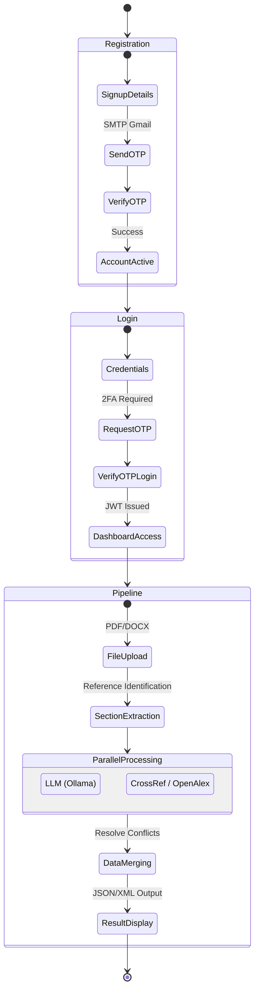

# Research Paper Reference Agent: Full-Project Architecture (UML)

This document provides a comprehensive view of the entire system architecture, including the processing pipeline, AI integration, security layers, and DevSecOps infrastructure.

## 1. Comprehensive Class Diagram
This diagram illustrates the full structural hierarchy of the Reference Agent ecosystem.

```mermaid
classDiagram
    direction TB
    namespace Frontend_NextJS {
        class AuthProvider {
            +user: User
            +token: string
            +login(credentials)
            +logout()
            +verifyOTP(code)
        }
        class AxiosInstance {
            +interceptors: request/response
            +attachToken()
            +handle401()
        }
        class FileUploadComponent {
            +onDrop(files)
            +validateType()
            +startProcessing()
        }
        class Dashboard {
            +jobStatus: ProcessingStatus
            +references: Reference[]
            +exportJSON()
        }
    }

    namespace API_Layer_FastAPI {
        class MainAPI {
            +upload_pdf()
            +parse_reference()
            +health_check()
        }
        class AuthRouter {
            +register()
            +request_otp()
            +verify_otp()
        }
        class JobManager {
            +jobs: Map<UUID, Status>
            +create_job()
            +update_progress()
        }
    }

    namespace Processing_And_AI {
        class PDFProcessor {
            +extract_text_plumber()
            +extract_text_fitz()
            +detect_bib_section()
        }
        class WordProcessor {
            +process_docx()
            +process_doc()
        }
        class EnhancedParser {
            <<Service>>
            +parse_with_hybrid_logic()
            +resolve_conflicts()
        }
        class SimpleParser {
            +regex_match()
        }
        class OllamaParser {
            +prompt_gemma(text)
            +sanitize_json()
        }
    }

    namespace Enrichment_External {
        class BaseAPIClient {
            +get(url, params)
            +handle_rate_limit()
        }
        class CrossRefClient {
            +search_by_title()
            +get_by_doi()
        }
        class OpenAlexClient {
            +fetch_abstract()
            +verify_authors()
        }
        class SemanticScholarClient {
            +get_citations()
        }
    }

    namespace Security_Infrastructure {
        class EmailService {
            +SMTP_Server
            +send_otp(email, code)
        }
        class GitHubActions {
            +Trufflehog_Scan()
            +Bandit_SAST()
            +ESLint_Quality()
        }
        class DockerContainer {
            +FastAPI_Image
            +NextJS_Static
        }
    }

    %% Core Relationships
    MainAPI ..> JobManager : Tracks
    MainAPI --> AuthRouter : Authenticates
    MainAPI --> FileUploadComponent : Receives
    
    EnhancedParser --> SimpleParser : Fast Pass
    EnhancedParser --> OllamaParser : Intelligent Fallback
    EnhancedParser --> Enrichment_External : Enriches Data
    
    Enrichment_External <|-- CrossRefClient
    Enrichment_External <|-- OpenAlexClient
    Enrichment_External <|-- SemanticScholarClient
    
    EmailService <.. AuthRouter : OTP Delivery
    GitHubActions ..> MainAPI : Scans Code
```

## 2. Comprehensive Activity Diagram (The End-to-End Pipeline)
This diagram tracks the lifecycle of both a User Session and a Research Paper.



# Reference Agent: System UML Diagrams

These diagrams represent the architectural flow and structure of the **Reference Agent** as of the latest milestone.

## 1. Class Diagram (System Structure)
This diagram shows the relationship between the Frontend, Backend, and AI Infrastructure.



## 2. Activity Diagram (User & Pipeline Flow)
This shows the end-to-end process from registration to document results.



## 3. Architecture Context & Vision
*   **Agentic Orchestration**: The system acts as an autonomous agent that not only extracts data but iteratively verifies and corrects it against global academic sources.
*   **Hybrid AI Strategy**: Combines the precision of deterministic parsing (Regex) with the intelligence of probabilistic parsing (Local LLMs) and the authority of cloud APIs.
*   **Zero-Trust Identity**: Every layer—from document ingestion (Malware scanning) to user identity (Multi-Factor SMTP OTP)—is hardened against common threats.
*   **Future Roadmap**:
    - **Persistent Memory**: Transitioning from memory-based storage to a robust relational/vector database for historical research tracking.
    - **Knowledge Graph Integration**: Transforming processed citations into a linked-data graph for advanced researcher discovery and mapping.
    - **DevSecOps Maturity**: Continuous scanning and automated vulnerability management as core architectural pillars.
